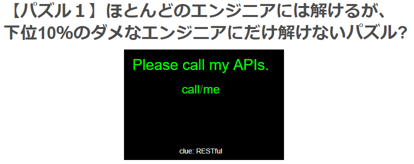
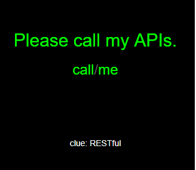
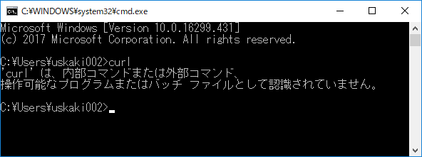
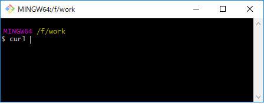

<h3 style="text-transform:none;">Windowsユーザに厳しいWebの世界</h3>
<!--
本当はタグを書かず、
「### タイトル」
って書きたいんだけど、それだと全部大文字になっちゃうんだよ。
設定でどうにかできるかもしれないけど、分からなかったから、こうした。
-->
　  
###### ～ほとんどのエンジニアには解けるが、下位10％のダメなエンジニアにだけ解けないパズル？～

　
　  
　  
　　　　id:kakisoft
---
### 自己紹介  
　  
**名前**：垣花　暁（かきのはな　さとる）    
　  
**出身**：沖縄県  
　  
**仕事**：物流系エンジニア（フリーランス）  
.NET/Java/Oracleがメイン。  
物流業界向けの言語や機器が使えます。  
　  
**趣味**：リアル脱出ゲーム
---
発端はこれ。  
  
http://challenge-your-limits.herokuapp.com/  
---
#### これは？
　  
ベルリンのスタートアップに勤務している、  
日本人エンジニアの  
「ジャバ・ザ・ハットリ」さんが、  
シンガポールに勤務していた頃に作成した、  
候補者を振るいにかけるためのパズル。
---
#### どんなクイズ？
　  
API を叩き、いくつかの関門を突破して行けば、  
正解に辿り着けるクイズ。
---
  
　  
curl使えばいいよ！という  
出題者からのヒント。
---
しかし、Windowsでcurlを叩くという行為は、  
実は、それなりにハードルが高い。
---
  
まず、コマンドプロンプトからは使えない。
---
Power Shell 使えば行けるんじゃね？
---
Power Shellの curlは、  
「Invoke-WebRequest」のエイリアスで、  
curlとは挙動が異なる。  
　  
そのためか、第二関門あたりで行き詰り、  
正解までたどり着くことが出来ない。
---
なので、サードパーティ製のツールに  
頼る事になる。
---
  
Postmanを使えば解けます。
---
でも、出題者の意図通り、curlで解いてみたい。
---
#### とりあえず、以下の選択肢。
　  
 * Virtual Boxにインストールした Linuxを使う
 * Windows Subsystem for Linux（旧名：Bash on Ubuntu on Windows）を使う
---
しかし、これだと厳密には  
Windowsを使っているとは言えない。
---
何とか、  
　  
 「Windowsで」  
 「curlを使って」  
　  
解きたい！
---
そして、辿り着いた答え。
---
  
<h4 style="text-transform:none;">git bush！</h4>
---
無事に正解に辿り着けました！
---
これなら、元々インストールされている可能性は  
極めて高い！  
　  
正攻法として使って行けそうだ！
---
1234567890123456789012345678901234567890
  
１２３４５６７８９０１２３４５６７８９０１２３４５６７８９０
こんな感じで、  
「curlでAPIを叩いて、ごにょごにょする」という、  
Webエンジニアにとっては何でもない行為でも、  
Windowsユーザにとっては、  
結構ハードルが高かったりします。
---
という訳で、
---
Mac 買いに行きたいんで、  
誰か付き合ってください。
---
そして、
---
興味が沸いた方は、是非挑戦してみて下さい！

####『ほとんどのエンジニアには解けるが、下位10％のダメなエンジニアにだけ解けないパズル？』

http://challenge-your-limits.herokuapp.com/  
---
##### ※補足※
現在はWindows10にcurlをインストールできます。  
クイズを解いた 2016年頃は Win7を使ってました。  

後、最近のサードパーティ製のターミナルは bashが使え、
curlも使える事が多いので、以前ほど苦労する事はありません。
（以前は bashは使えても、curlは使えないツールが多かった。）
---
~~まぁ、Windows には IE という全Webエンジニアにとっての敵が居るので、厳しいとか言ってら（略~~
---
おわり